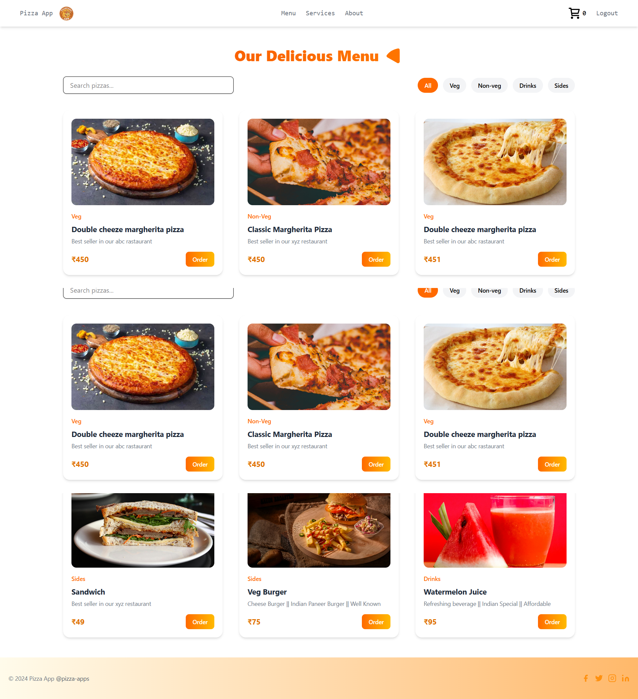
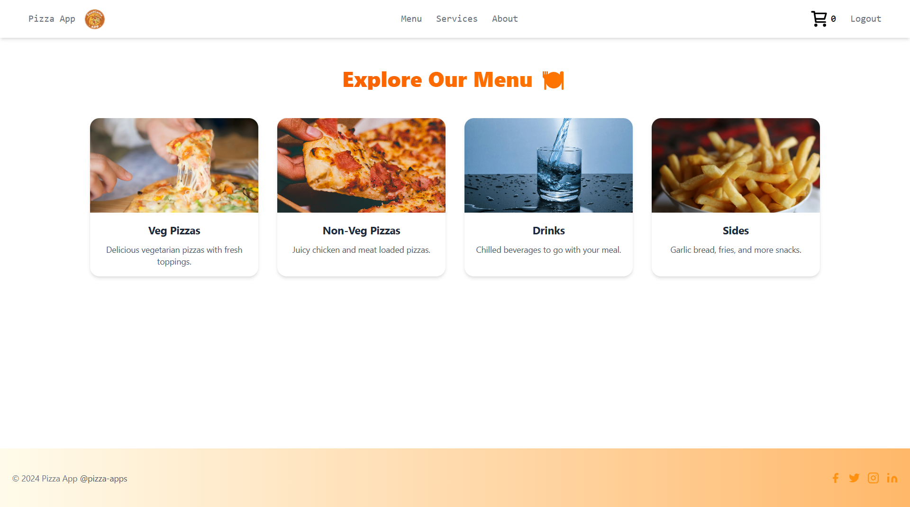
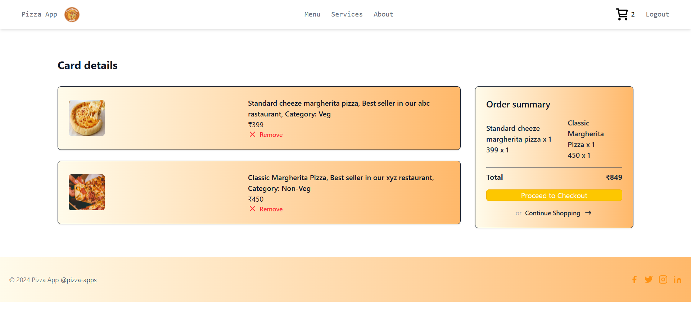
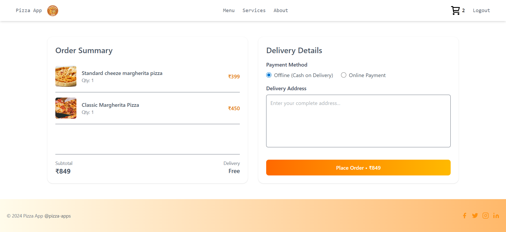

# 🍕 FoodComaApp

_MERN Stack • Online Food Ordering Platform_

**FoodComaApp** is a full-stack food ordering platform where users can browse delicious meals, add items to cart, and place orders with ease.  
It features a modern **UI design**, **Redux Toolkit state management**, secure **authentication**, and smooth ordering flow.

---

- 🔗 **Frontend:** [foodcoma-frontend.netlify.app](https://foodcomaapp.netlify.app/)
- 🔗 **Backend API:** [foodcoma-api.onrender.com](https://foodcomabackend.onrender.com)
- 📦 **Frontend Repo:** [FoodComaFrontend](https://github.com/Saroj05Dev/FoodComaFrontend)
- 📦 **Backend Repo:** [FoodComaBackend](https://github.com/Saroj05Dev/FoodComaBackend)

---

## 📑 Table of Contents

- [🛠️ Tech Stack](#tech-stack)
- [📸 Screenshots](#screenshots)
- [🚀 Features](#features)
- [📁 Project Structure](#project-structure)
- [📂 Environment Variables](#environment-variables)
- [💻 Run Locally](#run-locally)
- [🙋‍♂️ Author](#author)
- [🤝 Contributing](#contributing)
- [📜 License](#license)

---

## Tech Stack

| Layer         | Technologies                       |
| ------------- | ---------------------------------- |
| **Frontend**  | React, Redux Toolkit, Tailwind CSS |
| **Backend**   | Node.js, Express.js, MongoDB       |
| **API Calls** | Axios + Redux AsyncThunk           |
| **Auth**      | JWT-based Authentication           |
| **Images**    | Cloudinary                         |
| **Toast**     | React Hot Toast                    |

---

## Screenshots

### 🏠 Home Page

### 🍕 Meal Page

### 🍔 Menu Page

### 🛒 Cart Page

### 📦 Order Page

---

## Features

### 👤 User Features

- 🔐 Register & Login with JWT authentication
- 🍽️ Browse food categories & items
- 🛒 Add to Cart, remove items
- 💳 Place orders seamlessly

### 👨‍💼 Admin Features

- 🧾 Add/update/delete food items
- 📦 Manage orders & track status
- 📊 Dashboard to view app activity

### 💡 Additional Features

- 📤 Upload food images to **Cloudinary**
- 🔔 Real-time notifications with **React Hot Toastify**
- 🧭 Pagination for menu browsing
- 🧑‍⚖️ Role-based route protection (User/Admin)

---

## Project Structure

├── FoodComaFrontend/ # React Frontend
│ ├── src/
│ ├── public/
│ └── .env
│
├── FoodComaBackend/ # Node.js + Express Backend
│ ├── src/
│ │ ├── controllers/
│ │ ├── routes/
│ │ ├── services/
│ │ ├── repositories/
│ │ └── schemas/
│ └── .env
│
├── README.md
└── package.json

---

## Environment Variables

### Frontend (`.env`)

VITE_BACKEND_URL="your backend api url"

### Backend (`.env`)

PORT=5000
DB_URL="your mongodb url"
JWT_SECRET="your jwt secret"
CLOUDINARY_API_KEY="your cloudinary api key"
CLOUDINARY_API_SECRET="your cloudinary api secret"
CLOUDINARY_CLOUD_NAME="your cloudinary name"

---

## Run Locally

### Clone and Setup Frontend

git clone https://github.com/Saroj05Dev/FoodComaFrontend.git
cd FoodComaFrontend
npm install
npm run dev

### Clone and Setup Backend

git clone https://github.com/Saroj05Dev/FoodComaBackend.git
cd FoodComaBackend
npm install
npm start

---

## Author

**Saroj Kumar Das**

- 📧 Email: [sarojkumardas.dev@gmail.com](mailto:sarojkumardas.dev@gmail.com)
- 🔗 LinkedIn: [Saroj Kumar Das](https://www.linkedin.com/in/saroj-kumar-das-86a36b30a/)

---

## Contributing

Contributions, issues, and feature requests are welcome!

Feel free to:

- Fork this repository
- Open issues for bugs or feature requests
- Submit pull requests

---

## License

This project is licensed under the **MIT License** – free to use and modify.
